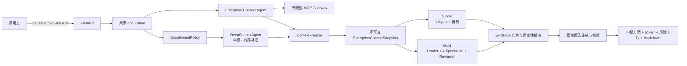

# Jindiao（尽调）

基于 openJiuwen agent-Core AgentTeams 与 DeepSearch 的单机高代码企业信用与风控尽调应用。系统先按产品依赖共享采集并冻结企业事实，再让一个真实调查 Agent 或一个真实调查团队在同一证据快照上完成固定核查，最后生成与产品原型一致的申报方案、§1–§7、风险卡片和 Markdown 报告。

> 这是竞赛与工程演示项目，不是生产征信服务，输出不能替代人工授信、审计或法律意见。仓库内企业均为虚构 Mock 数据。

## 核心能力

- 正式流程分为共享 `acquisition`、只读快照上的 `investigation`、统一 `adjudication` 三层；`ContextFreezer` 是采集和调查之间的不可变边界。
- `EnterpriseContextAgent` 是天眼查 MCP 的唯一业务调用者，负责主体锚定、能力发现、36 个产品采集项的来源状态与 Evidence 归一化，不作风险判断。
- `deepsearch-agent` 只执行显式 `baseline_enrichment` / `evidence_gap` 补充任务；年报 Skill/Tool 只授予该 Agent，且社保披露仅归入 `operations-analysis/annual_reports/social_security` 的局部事实，不产生第 49 个子模块。
- single 是 1 个真实 `ReActAgent`，负责全部 19 项固定核查和自检；multi 是 Leader、4 个专业调查 Agent、Reviewer 组成的真实 AgentTeams，负责分配、并行核查、复核与有界返工。
- 调查 Agent 只能按权限读取冻结快照并提交 `risk | no_risk | inconclusive`；必需 Evidence 缺失、来源失败或冲突未解时只能提交 `inconclusive`。
- 确定性规则负责风险分和 `[0,20)` / `[20,80)` / `[80,+∞)` 分档；模型不能自由改分。
- v2 Run 资源接口用于前端创建、查询、SSE 重连、结果读取和取消；v1 `result` 兼容接口继续通过 `mode=single|multi` 返回完整结果。两套入口共享同一个 `RunCoordinator`，不复制编排逻辑。
- 四个可独立挂载的 Skills，其中年报社保 Skill 仅注册给 DeepSearch 成员，报告反馈 Demo 支持真实九例回放、手动本地应用和恢复基线。
- 公平成对 Runner 对每个样本只采集一次，两臂共享快照、模型、公共 Prompt 核心、核查目录和数值相同的总分析预算；Prompt 正文、私有思维链、密钥和未脱敏外部响应不会进入公开产物。

## 架构



所有组件运行在一个 Python 进程和一台机器上；不需要数据库、Redis、消息队列或独立向量服务。详细设计见 [产品设计](docs/product-design.md) 和 [技术栈](docs/technical-stack.md)。

## 快速开始

要求 CPython 3.11、Git 和 [uv](https://docs.astral.sh/uv/)。agent-Core 从公开 Python 包安装；DeepSearch 从公开仓库的固定 commit 安装。本机相邻源码目录仅供阅读，不是依赖。

```bash
cp .env.example .env
make install
make check
make mock-demo
```

无模型或天眼查凭据也能运行冻结 Mock 演示。该路径是 `formal_agent_run=false` 的 deterministic harness，只用于演示、契约测试和回归，不能作为真实 Agent 协作增益证据。结果、脱敏轨迹、指标和报告写入 `artifacts/<run_id>/`。

`.env.example` 显式选择 deterministic harness。正式 Agent 运行必须同时设置 `JINDIAO_AGENT_RUNTIME_MODE=formal`、非 fake `MODEL_PROVIDER` 及完整 `MODEL_NAME` / `MODEL_BASE_URL` / `MODEL_API_KEY`；缺少任一配置都会在业务调查前明确失败，不会静默回退。

数据来源由请求与运行时配置明确决定：默认 `JINDIAO_DATA_SOURCE_MODE=mock`；改为 `tianyancha`、配置授权且省略 `scenario_id` 时，由 Context Agent 通过受控 Gateway 查询真实主体和 capability manifest，按固定报告与核查依赖规划 36 个产品采集项。策略启用时，DeepSearch Agent 在冻结前从白名单年报 Provider 做一次基础补充，并可处理获准的缺口/冲突补证。每个采集项都保留 `available`、`verified_empty`、`capability_absent`、`source_error` 或 `not_requested` 状态。指定 `scenario_id` 时固定走 deterministic Mock 演示，不成为 formal Agent 评测。

启动 API：

```bash
make dev
```

或使用单服务容器：

```bash
docker compose up --build
```

## 部署入口

本地启停使用 shell（Bash、Docker Engine、Compose；宿主机不需要 Python 来启动服务）：

```bash
./bin/start.sh
./bin/restart.sh
./bin/stop.sh
./bin/local status
./bin/local logs
```

本地启动默认读取项目 `.env`，固定为 `formal + tianyancha + attached + local`，禁止 Mock 降级。保留已有模型路由、密钥和预算，缺少必要凭据直接失败；不创建/覆盖 `.env` 或 `.env.local`。只有显式 `./bin/start.sh --mock` 才使用无凭据 Mock。服务仍只监听 `127.0.0.1:8080`，沿用原 named volume。`restart` 不构建镜像或应用配置修改，`stop` 不删除容器/数据；切换配置或更新代码用 `start.sh`。旧 `bin/local` 保留为 shell 兼容入口。

ECS 拆为本地打包和服务器部署，不再从本机通过 SSH 一键发布：

```bash
./bin/ecs-package --dry-run
./bin/ecs-package
```

打包输出为 `artifacts/ecs-packages/<发布号>.tar.gz` 和 `.sha256`，不包含凭据，不连接服务器，也不要求本地 Docker。手动上传、校验和解压后，在 ECS 的包目录执行 `./deploy.sh --config config.json --dry-run`；实际发布需显式 `--apply --maintenance-confirmed`。包内还提供 `start.sh`、`restart.sh`、`stop.sh`，只操作现有服务；重启/停止需要 `--maintenance-confirmed`。宿主机 Python 3.6 用于 JSON 配置读取和发布迁移，启停由 shell 调用 Docker，应用镜像仍使用 Python 3.11。

AgentArts 镜像交付仍默认预览，执行需 `--apply`：

```bash
./bin/agentarts --image swr.cn-southwest-2.myhuaweicloud.com/tongdun/jindiao:release-unique-arm64 --dry-run
```

ECS 部署保留旧容器/原卷及失败恢复；AgentArts 入口只交付镜像，不创建运行时或切换云版本。完整步骤见 [部署总览](docs/deployment/README.md)、[ECS 打包与服务器部署](docs/deployment/ecs.md)、[AgentArts 交付与后续部署](docs/deployment/agentarts.md)。`make local/ecs-package/agentarts ARGS='...'` 为相应入口的快捷方式；原 `bin/ecs` 已移除。

## Run API（前端观测）

```http
POST /api/v2/due-diligence/runs
GET  /api/v2/due-diligence/runs/{run_id}
GET  /api/v2/due-diligence/runs/{run_id}/events
GET  /api/v2/due-diligence/runs/{run_id}/result
POST /api/v2/due-diligence/runs/{run_id}/cancel
```

创建 Run 返回 `202` 和 `RunResource`。事件接口支持 `Last-Event-ID`/`after` 历史重放及 SSE 断线续订；结果接口在运行中返回 `202`，完成或可恢复部分结果时返回安全 JSON。AgentArts PREFIX_MATCH 可将这些 GET/POST/SSE 路径与 `/invocations` 映射到同一个运行时，详见 [API 文档](docs/api/README.md)。

v2 与 `/invocations` 使用一级表单字段，创建请求示例：

```json
{
  "customerName": "示例企业有限公司",
  "uscc": null,
  "product": "流动资金贷款",
  "amount": 5000,
  "term": 12,
  "manager": "王某某",
  "branch": "城东支行",
  "mode": "multi"
}
```

`amount` 为万元，后端统一换算，报告金额仍为元。客户名称或信用代码至少提供一个；不再接受 `enterprise`、`business_context`、`region` 等旧入参。必要控制参数仍在一级，完整列表见 API 文档第 2.1 节。下方 v1 示例保留原嵌套契约。

## v1 兼容业务 API

```http
POST /api/v1/due-diligence/result?mode=multi
```

JSON 调用：

```bash
curl -X POST http://127.0.0.1:8000/api/v1/due-diligence/result \
  -H 'Content-Type: application/json' \
  -H 'Accept: application/json' \
  -d '{"enterprise":{"company_name":"金调双源制造有限公司"},"scenario_id":"evidence-conflict"}'
```

查询参数 `mode` 可取 `single` 或 `multi`，省略时默认 `multi`；它只改变冻结快照之后的调查拓扑。SSE 调用只需改为 `Accept: text/event-stream`，最后一个 `report.completed` 事件携带与 JSON 调用同契约的完整结果。请求、结果字段、事件和错误码见 [API 文档](docs/api/README.md)。内部 Agent、Tool 和 DeepSearch 不暴露独立 HTTP 端点。

旧 `skill_feedback` 已 deprecated，统一返回 `rejected/use_feedback_api`，主报告照常完成。新的本地反馈 Demo 通过两个 v2 接口提交反馈与查询真实对比，再由演示者以 CLI 明确 apply/reset；只优化已有缺口的展示位置。运行独立目录闭环：

```bash
uv run python scripts/run_reporting_feedback_demo.py --output "$(mktemp -d)/feedback-demo"
```

脚本使用固定虚构数据与进程内 HTTP，输出 before/after/diff、九例评测、应用收据和新旧 Run 证据，并恢复基线；无需凭据或启动监听端口。启动本地反馈服务和手动命令见 [反馈 Demo](docs/reporting-feedback-demo.md)。

## 数据来源语义

系统同时保留 Evidence 来源状态和快照覆盖状态，严格区分：

- `verified_records`：能力存在且返回记录；
- `verified_empty`：已成功核验为空，禁止 Mock 覆盖；
- `capability_absent`：能力不存在；只有策略批准的补充任务可以增加独立 Evidence，不能改写原状态；
- `source_error`：鉴权、超时、限流或协议错误，不等同“无风险”；
- `not_requested`：预算或终止导致未请求，必须进入显式缺口；
- `degraded_mock`：仅 deterministic 演示显式降级时启用；结构化结果逐条标明。

真实凭据只写入本机 `.env`：

```dotenv
JINDIAO_DATA_SOURCE_MODE=tianyancha
JINDIAO_AGENT_RUNTIME_MODE=formal
TIANYANCHA_MCP_URL=https://mcp.tianyancha.com/v1
TIANYANCHA_MCP_AUTHORIZATION=<your-runtime-secret>
JINDIAO_TIANYANCHA_ANNUAL_REPORT_ENABLED=true
JINDIAO_TIANYANCHA_ANNUAL_REPORT_LOOKBACK_YEARS=5
JINDIAO_TIANYANCHA_ANNUAL_REPORT_TIMEOUT_SECONDS=15
MODEL_NAME=<your-model>
MODEL_API_KEY=<your-runtime-secret>
```

配置好本机 `.env` 后，可先运行不会保存原始响应的授权连通性验证：

```bash
make verify-tianyancha
```

## 可复用 Skills

| Skill | 类型 | 用途 |
| --- | --- | --- |
| `tyc-evidence-acquisition` | Agent | 主体锚定、能力路由、来源状态和 Evidence 标准化 |
| `tianyancha-annual-report-social-security` | Agent | 约束天眼查最近可用年报的社保补证；允许 `verified_empty` |
| `evidence-backed-due-diligence` | Team | 计划、Finding/Evidence、Reviewer 与 RepairTask 协作协议 |
| `feedback-evolved-reporting` | Team | 已有缺口就近披露、真实回放、本地应用与恢复 |

每个目录包含 `SKILL.md`、输入输出 JSON Schema、示例、评测集、`VERSION`、`CHANGELOG.md`、`mount.json` 和 `agents/openai.yaml`。复制任一技能目录到目标项目后，按相对路径读取 `mount.json` 即可加载；运行时不依赖本仓库绝对路径。

报告 Demo 的活动策略由 `ReportingDemoStore` 管理，位于 artifact root 的 `reporting-demo/`，不会改写 Skill 文件或模型 Prompt。Run 首次受理时固定实际策略；候选通过源案例及八个独立案例的输出检查仍需明确本地 apply。旧 Rail/注册表 helpers 仅为兼容基础设施，不代表当前产品执行它们或具备生产发布治理。技能包 ABI `VERSION=1.0.0` 与报告运行策略基线 `1.1.0` 是不同的版本字段。

## Single vs Multi 实验

```bash
make benchmark
# 等价的独立脚本入口：
uv run python scripts/compare_agents.py --manifest benchmarks/manifest.json --output benchmarks/results/latest
```

冻结配置为 10 个场景 × 3 次重复 × 2 种模式，共 60 条 deterministic regression records。它用于验证契约、评分和失败样本保留，`formal_agent_run=false`，不能单独证明真实 Agent 协作增益。质量权重为覆盖率 30%、证据支持率 25%、风险质量 20%、冲突检出率 15%、报告结构 10%。

当前本机 Mock 参考结果：

| 指标 | Single | Multi | 差值 |
| --- | ---: | ---: | ---: |
| 主质量分 | 0.65625 | 0.76125 | +0.10500 |
| 成功率 | 0.80000 | 0.80000 | 0 |
| 冲突检出数/样本 | 0 | 0.30000 | +0.30000 |
| 返工数/样本 | 0 | 0.60000 | +0.60000 |

该 Mock 回归中的主质量分相对提升约 16.0%，paired 95% 区间为 `[0.046624, 0.163376]`，但这不是 formal 协作增益结论。2026-09-05 另完成一组 `formal_eligibility.eligible=true` 的真实 paired smoke：两臂共享同一 snapshot、`qwen-plus`、15 项核查和 1,500,000 总 Token 预算；single 使用 19 次 LLM / 1,124,467 Token，multi 使用 43 次 LLM / 828,676 Token。单组 smoke 只证明执行与公平门禁成立，仍不足以宣称协作增益。方法与限制见 [评测文档](docs/evaluation/README.md)。

可提交的冻结结果位于 [`benchmarks/reference/`](benchmarks/reference/)，包含 60 条逐场景记录、聚合摘要、失败样本与 Markdown 对比；数据、规则、Skills、模型配置和结果哈希见 [`release/frozen-manifest-v1.json`](release/frozen-manifest-v1.json)。

## 开发与验证

```bash
make format       # 自动格式化
make check        # Ruff + mypy + pytest + 覆盖率门禁
make verify-install
```

最终质量门禁、授权联调与环境限制记录见 [验证报告](docs/verification-report.md)，现场演示顺序见 [演示检查清单](docs/demo-checklist.md)。

`requirements.txt` 是完整开发/参赛环境，`pyproject.toml` 是包和分组声明，`uv.lock` 固定传递依赖。安装验证会拒绝 `/Users/...`、`file://`、`../agent-core` 和 `../deepsearch` 等本地源码依赖。

## 目录

```text
src/jindiao/        应用、契约、Agent、适配器、规则、报告、评测与观测
bin/                本地启动、ECS 本地打包、AgentArts 镜像交付入口
deploy/             非敏感部署模板与平台交付资源
scripts/            开发/验收脚本与部署实现
skills/             四个独立可复用技能包
mock_data/          版本化场景、语料和 evaluator-only expected
benchmarks/         冻结清单与基准输出
release/            数据、规则、Skills、模型与评测结果哈希
tests/              unit / contract / integration / e2e
docs/               产品、架构、API、部署和评测文档
artifacts/          本地运行产物（默认 Git 忽略）
```

贡献规范见 [CONTRIBUTING.md](CONTRIBUTING.md)，安全披露见 [SECURITY.md](SECURITY.md)。项目使用 [MIT License](LICENSE)。
