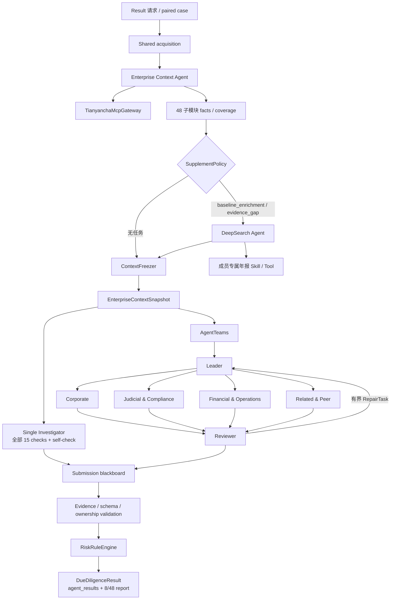

# Agent 工作流与 agent-Core / DeepSearch 能力映射

- 状态：Implemented v2
- 更新：2026-09-05

## 1. 结论

当前正式路径已经不是“建队后由 Python 领域函数完成调查”的伪 Agent 流程。它包含版本化 Prompt、真实模型调用、受限工具调用、结构化提交和公开 usage：

- acquisition：`EnterpriseContextAgent` 和可选 `deepsearch-agent` 负责外部事实采集；
- investigation：single 的 1 个真实 Agent，或 multi 的 Leader + 4 个专业 Agent + Reviewer，负责同一套 15 项固定核查；
- adjudication：确定性 Evidence 门禁、规则评分和 8/48 报告组装。

系统会保存 Prompt 版本与 SHA-256、结构化任务/判断摘要、Evidence 引用、模型 usage 和终止原因，但不会公开 Prompt 正文或模型私有思维链。`reasoning`、`reasoning_content`、`chain_of_thought`、密钥和未脱敏外部响应都会从公开事件与产物中递归删除。

## 2. 端到端工作流

`ContextFreezer` 之前可以调用经批准的外部来源；之后所有调查 Agent 只能读取冻结快照。single 和 multi 不会各自重新取数。

## 3. 各 Agent 的真实职责

| Agent | 阶段 | 允许能力 | 权威输出 |
| --- | --- | --- | --- |
| Enterprise Context Agent | acquisition | 天眼查 Gateway 的主体解析、capability 发现、目录化采集工具 | 48 子模块 facts、coverage、Evidence、无风险项的 acquisition result |
| DeepSearch Agent | acquisition | 仅显式 `SupplementTask`；成员专属年报 Skill/Tool 或获准补证 Provider | 独立 supplemental Evidence、provenance、局部 coverage；不改写 MCP 状态 |
| Single Investigator | investigation | 全部核查的最小权限快照读取、`submit_check_result`、完成自检 | 15 项 `CheckResult`，聚合 RiskItem 与 FactEvidenceRef |
| Leader | investigation / multi | `submit_check_assignments`、读取进度、原生任务/消息协调 | 覆盖全部启用核查的分配计划；不直接生成正式风险项 |
| Corporate Agent | investigation / multi | 只读获分配快照范围、结构化提交 | 工商存续、变更、股权和控制权核查 |
| Judicial & Compliance Agent | investigation / multi | 同上 | 执行、失信限高、经营异常、处罚和权利负担核查 |
| Financial & Operations Agent | investigation / multi | 同上 | 盈利、偿债、现金流、收入和人员规模一致性核查 |
| Related & Peer Agent | investigation / multi | 同上 | 关联方控制和同业偏离核查 |
| Reviewer | investigation / multi | 读取已提交核查、`submit_review` | `ReviewIssue`、最多受预算约束的定向 `RepairTask`；不修改事实或评分规则 |

DeepSearch Agent 不在 multi 调查 roster 中。Enterprise Context Agent、single、Leader、专业 Agent 和 Reviewer 都不会继承它的年报 Skill/Tool。调查 Agent 的外部 MCP、网页搜索和系统操作权限集合为空。

## 4. Prompt 如何参与运行

Prompt bundle 位于 [`src/jindiao/prompts/bundle_v1/`](../src/jindiao/prompts/bundle_v1/)，由 manifest 版本化和校验。正式启动时系统组合：

1. 公共调查核心：固定核查、快照只读、Evidence 引用、来源状态、缺数语义、结构化提交、禁止最终评分；
2. 角色层：single、Leader、四类专业 Agent 或 Reviewer 的职责差异；
3. 核查模板：从 CheckCatalog 注入 check ID、证据要求、时间窗口、缺数策略与报告映射；
4. 运行数据：主体、报告时点、snapshot ID / SHA-256、任务授权等作为结构化 user payload 注入，不能进入 System 指令层。

single 与 multi 共用同一个 `prompt_core_version` 和 `prompt_core_sha256`。角色 Prompt 可以不同，但会记录版本/哈希并进入公平性元数据。Prompt 缺片段、角色不存在或核查模板未注册时，运行会在创建 Agent 前失败。

Prompt 正文是运行时内部配置，不属于公开 Result。公开审计只保留：Agent/角色、Prompt 版本与哈希、check/task ID、受限 `decision_summary`、Evidence ID、模型 usage、提交/复核结果和终止原因。系统不承诺、保存或尝试推断模型的隐藏推理过程。

## 5. 固定报告目录与固定核查目录

`ReportCatalog` 与 `DueDiligenceCheckCatalog` 是两套独立目录：

- 报告目录回答“最终报告展示什么”，固定为 8 大模块、48 个唯一标准子模块；
- 核查目录回答“Agent 判断什么”，当前固定 15 项，且每项定义负责人、必需/可选子模块、Evidence 门槛、时间窗口、缺数策略、严重度策略和输出 schema。

15 项核查包括：工商存续、工商变更、股权/控制权、重大执行、失信/限高、经营异常、行政合规处罚、股权/资产权利负担、盈利能力下滑、偿债压力、现金流压力、收入异常、关联方控制、同业偏离、人员规模与参保一致性。

二者是多对多映射。例如 `profitability-decline` 同时需要 `financial_summary` 和 `income_statement`，可参考 `annual_reports`；一个 `annual_reports` 子模块也可以支持收入或人员一致性核查。年报社保属于 `annual_reports.social_security` 局部事实组，不新增第 49 子模块，也不能代替利润表或财务年报。

## 6. 快照读取与结构化提交

`EnterpriseContextSnapshot` 包含主体、报告时点、目录版本、48 个 `SubmoduleContext`、规范 Evidence、provenance、补充任务、未解决缺口/冲突和共享采集成本。稳定序列化生成 `snapshot_id` / SHA-256，冻结后不可修改。

专业 Agent 只能读取任务授权的子模块。bulk 读取返回判断所需的 `submodules[].facts`、Evidence ID、coverage 和来源元数据；不会再在 `evidence_items[].value` 重复整份事实。确需逐 Evidence 核对时，可通过受限逐项读取获得规范值。越权读取被确定性拒绝并记录 `snapshot.read_denied`。

`SubmissionBlackboard` 校验 Run、Agent、主体、snapshot、check/task 所有权、Evidence ID、Prompt/schema 版本和幂等性。Agent 自由文本回答不会被解析为业务结果，只有提交工具接受的 `CheckResult` 才是权威调查输出。

每个 `CheckResult` 状态为：

- `risk`：Evidence 满足要求，且支持一个或多个结构化 RiskItem；
- `no_risk`：Evidence 满足目录声明的正常结论门槛；
- `inconclusive`：必需 Evidence 缺失、来源失败、未请求、冲突未解或不足以作确认性判断。

`risk` / `no_risk` 没有合格 Evidence 时会被提交门禁拒绝或安全降级；`verified_empty` 只说明特定来源成功核验为空，不自动代表整个核查无风险。

## 7. agent-Core 使用深度

### 7.1 单 Agent

`SingleInvestigatorAgent` 和采集 Agent 都创建真实 openJiuwen `ReActAgent`，注入版本化 System Prompt、模型、受限 ToolCard 和最大迭代数，并通过统一 streaming runtime 采集模型请求、工具事件、provider usage、取消和资源清理。single 必须逐项完成 15 个核查并调用自检工具；任何遗漏都不会由 Python 业务规则回填。

### 7.2 多 Agent

正式 multi 使用 `TeamAgentSpec`、预定义成员、scheduled dispatch、`Runner.run_agent_team_streaming` 和 AgentTeams 原生任务/消息控制面。Leader 提交目录化任务，专业成员读取各自快照范围并提交结果，Reviewer 复核后可发起定向返工。团队的业务终止条件是全部核查达到终态且 Reviewer 不再有 RepairTask，而不是 `build_team` 成功。

所有成员通过 Run 级 `BudgetLedger` 共享 LLM、输入/输出 Token、总 Token、schema 重试、返工、快照读取、并发和 deadline 限额。成功、异常或取消时都会停止并删除临时团队资源。

核心实现：

- [`enterprise_context.py`](../src/jindiao/agents/enterprise_context.py)
- [`single_investigator.py`](../src/jindiao/agents/single_investigator.py)
- [`agent_teams_investigator.py`](../src/jindiao/agents/agent_teams_investigator.py)
- [`team_spec.py`](../src/jindiao/orchestration/team_spec.py)
- [`blackboard.py`](../src/jindiao/investigation/blackboard.py)
- [`snapshot_access.py`](../src/jindiao/investigation/snapshot_access.py)

## 8. DeepSearch 使用深度

DeepSearch 是共享采集层的受管理补充 Agent，不是任意浏览器队友。当前生产能力以精确白名单的天眼查年报 Provider 为主：

1. `SupplementPolicy` 生成目标为 `annual_reports` 的 `baseline_enrichment` 任务，或有界 `evidence_gap`；
2. 任务绑定主体、报告时点、目标子模块、允许 Tool/来源、请求字段和最大调用数；
3. DeepSearch Agent 只能调用任务列出的能力；
4. 年报 Provider 仅访问 `https://www.tianyancha.com/annualReport/{company_id}/{year}`，校验 HTTPS、主机、主体、年度、公示日期和回显年度；
5. 只解析养老、医疗、生育、失业、工伤人数及缴费披露，`企业选择不公示` 保留为 `null` 而不是 0；
6. 输出 URL/文档标识、发布者、抓取时间、适用时点、内容哈希、可信度和独立 Evidence；无结果保留 `verified_empty` 范围。

应用层 `DeepSearchEvidenceAgent` facade 仅保留给 `formal_agent_run=false` 的 deterministic harness / 迁移兼容路径。formal 运行由真实 `deepsearch-agent` 调用 Tool，同一 Run 不会同时使用两个执行面。

核心实现：

- [`deepsearch_runtime.py`](../src/jindiao/agents/deepsearch_runtime.py)
- [`policy.py`](../src/jindiao/deepsearch/policy.py)
- [`tianyancha_annual_report.py`](../src/jindiao/deepsearch/tianyancha_annual_report.py)
- [`deepsearch_tools.py`](../src/jindiao/agents/deepsearch_tools.py)

## 9. 确定性裁决与公开结果

模型 Agent 只提交核查判断和 Evidence 引用。之后两种模式共用：

1. 接受结果完整性与 Evidence 归属校验；
2. Reviewer 底线检查、重复风险归并和未终态检查；
3. `RiskRuleEngine` 根据版本化规则生成 Finding、分数和 Decision；
4. `ResultAssembler` 将多个 Agent 的核查结果投影到 8/48 章节。

最终 `agent_results` 按 Agent 保留 `(risk_items, fact_evidence_refs)` 及 check/task 信息；`report_structure` 固定报告基本信息；`context_snapshot` 标识共同事实输入；`execution_cost` 分开记录共享采集和调查成本。Leader、Reviewer、Context Agent 或没有发现补充事实的 DeepSearch Agent 允许 `risk_items=[]`，但其任务、事实贡献、版本和状态仍可审计。

## 10. 公平 single vs multi 对比

`PairedComparisonRunner` 每个样本只运行一次 acquisition 和 freeze，再顺序执行两个隔离调查臂。调查前 `ComparisonFingerprint` 必须证明 snapshot、模型/采样参数、公共 Prompt、CheckCatalog、ReportCatalog、报告时点、分析预算、规则和 evaluator 版本相同。

formal 门禁还要求两臂均为非 fake 模型、有成功 LLM request、provider usage、非零 Token、完整有效的 15 项提交且未越预算。失败或 partial 样本保留在聚合中；multi 的 Leader、成员、Reviewer、通信和返工全部计入该臂唯一账本；共享 MCP / DeepSearch 成本只记录一次。

2026-09-05 的一组真实 paired smoke 已满足上述 formal 执行门禁，但单个 smoke 只证明架构和公平性约束可运行。只有完成预注册场景、重复次数、指标权重和阈值后，系统才允许产生协作增益结论；deterministic Mock benchmark 仅作回归证据。
