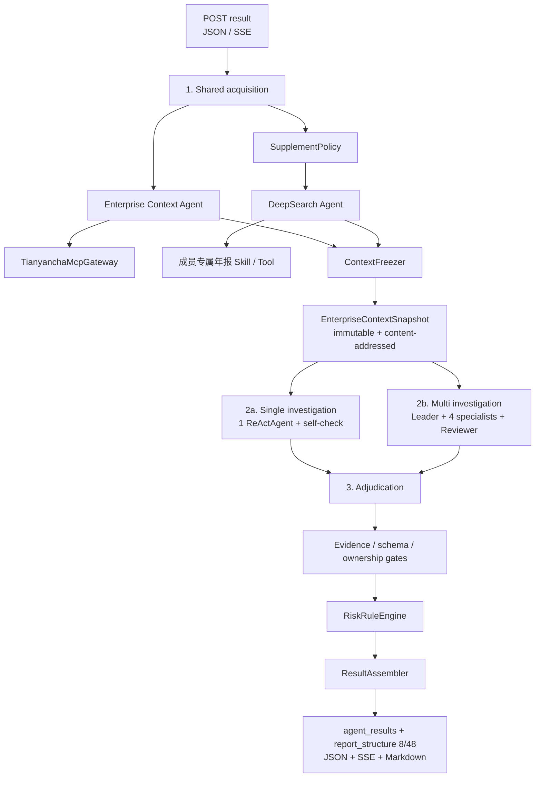

# 系统架构

- 状态：Implemented v2
- 更新：2026-09-05

Jindiao 是单机 Python 单体。FastAPI 只负责协议，正式业务由 `DueDiligenceService` 组织共享采集、冻结快照、Prompt 驱动调查和确定性裁决。`mode=single|multi` 只改变 investigation 拓扑；外部信息获取不会在两种模式中重复执行。

## 三层业务架构

`ContextFreezer` 是 acquisition 和 investigation 之间的硬边界。冻结后不能追加或修改 Evidence；需要补证时必须产生新 snapshot ID 和 SHA-256，并重新开始受影响的正式比较。

## 1. 共享采集层

`EnterpriseContextAgent` 是天眼查 MCP 的唯一业务调用者。它用版本化采集 Prompt 做主体解析、capability 发现和 48 个标准子模块的覆盖规划；受控 `TianyanchaMcpGateway` 执行 Run / Agent / 主体 / 报告时点 / capability / 预算绑定，以及授权、参数校验、分页、重试、并发、字段清洗、幂等和 Evidence 写入。

Context Agent 只产出事实、来源状态和 coverage，不产出 RiskItem、风险分或准入结论。每个标准子模块必须具有 `available`、`verified_empty`、`capability_absent`、`source_error` 或 `not_requested` 状态之一。

`SupplementPolicy` 只产生显式的：

- `baseline_enrichment`：当前实现为年报社保基础补充；
- `evidence_gap`：获准的能力缺失、来源错误、事实冲突或固定核查事实缺口。

只有 acquisition 阶段的 `deepsearch-agent` 获得年报 Skill/Tool。它不继承天眼查 MCP，不进入 multi roster，也不计入 single/multi 的调查 Agent 数。补充 Evidence 独立保留 provenance 和 `conflicts_with`，不得覆盖权威 MCP 的 `verified_empty` 或原始状态。社保披露只进入 `operations-analysis/annual_reports/social_security` 局部事实组，不能形成第 49 个子模块或完整财务年报 coverage。

## 2. Prompt 驱动调查层

调查由独立、版本化的 `DueDiligenceCheckCatalog` 驱动，当前固定 15 项核查。核查目录与报告目录是多对多关系：例如盈利能力下滑会读取财务主要指标、利润表并可参考年报；同一个子模块也可以支持多个核查。

两种拓扑共享快照、公共 Prompt 核心、CheckCatalog、结构化提交 schema、模型配置和确定性后处理：

- single：1 个 `SingleInvestigatorAgent` 领取全部核查，自主决定顺序，通过只读工具查询快照，逐项提交 `CheckResult`，最后在同一会话自检。Agent 结束时若仍有遗漏，运行以 partial/failed 收敛，Python 不会静默补齐。
- multi：Leader 按目录提交 `CheckAssignment`；Corporate、Judicial & Compliance、Financial & Operations、Related & Peer 四个专业 Agent 并行核查；Reviewer 读取提交黑板，提交 `ReviewIssue` / `RepairTask`；Leader 在统一返工预算内定向派回。团队持续到全部核查终态、失败、取消或预算耗尽，不会在建队成功后停止业务流程。

专业调查 Agent 的业务工具仅包括任务范围内的快照读取和结构化提交。Leader 只有分配/进度工具，Reviewer 只有提交读取/复核工具；所有调查成员都没有天眼查 MCP、DeepSearch、网页、系统操作或快照写权限。

每个核查只能提交 `risk`、`no_risk` 或 `inconclusive`。确认性的 `risk` / `no_risk` 必须满足目录定义的 Evidence 数量、必需子模块、来源和冲突条件；否则提交层拒绝或降级为 `inconclusive`。权威交付是 `AgentInvestigationResult` 中的 `risk_items + fact_evidence_refs`，不是自由文本回答。

## 3. 确定性裁决与报告层

两种模式都经过同一条后处理链：

1. 校验 schema、主体、snapshot、任务归属、提交版本和 Evidence 引用；
2. 执行确定性 Reviewer 底线检查及重复风险归并；
3. `RiskRuleEngine` 只基于已接受的固定核查结果计算正式分数和 Decision；
4. `ResultAssembler` 将核查结果投影到固定报告目录，同时保留 Agent 维度。

报告目录由 `ReportCatalog` 固定为 8 个模块、48 个唯一标准子模块：`report-summary` 和 `risk-summary` 是零子模块汇总章，其余模块分布为 6 / 9 / 12 / 13 / 4 / 4。模型不能提交最终分数、准入决定，也不能增删目录或核查项。

最终 `DueDiligenceResult` 在旧字段之外包含 `agent_results`、`report_structure`、`context_snapshot`、`execution_cost` 和 `comparison_metadata`。`agent_results` 包含 acquisition 与所选 investigation Agent 的贡献；Leader、Reviewer 或采集 Agent 可以没有风险项，但仍保留任务、事实引用、Prompt 版本和终止状态。

## 公平配对边界

`PairedComparisonRunner` 对一个样本先执行一次 acquisition 和 freeze，再把同一个 snapshot 对象分给 single 与 multi。两臂在调查前比较 `ComparisonFingerprint`，要求 snapshot、报告时点、provider/model、采样参数、公共 Prompt 哈希、CheckCatalog、ReportCatalog、分析预算、规则和 evaluator 版本一致；允许不同的只有拓扑与已记录的角色 Prompt。

两臂获得数值相同的总 investigation budget。multi 的 Leader、四个专业 Agent、Reviewer、通信、schema 重试和返工共用唯一账本。Context / DeepSearch / MCP 成本只记一次 `shared_acquisition_cost`；两臂分别记录实际 `investigation_cost`。

fake/offline、无成功 LLM usage、Token 为零、无有效固定核查提交或预算越界时，配对结果保留用于诊断，但 `formal_eligibility.eligible=false`，不能形成正式协作增益结论。

## 安全与持久化边界

数据文件在任务开始时做白名单和 SHA-256 校验，之后以只读快照共享；运行时不能读取 evaluator-only `expected/`。公开事件、Result、JSONL、Markdown 和 benchmark 产物递归删除 Prompt 正文、私有 `reasoning` / `reasoning_content` / `chain_of_thought`、密钥和未脱敏外部响应。审计使用受限 `decision_summary`、Evidence ID、快照哈希和版本信息，不记录或尝试重建私有思维链。

所有组件运行在一台机器和一个 Python 应用进程中；不需要业务数据库、Redis、消息队列或独立向量服务。AgentTeams 可使用任务期内的内存状态，外部 SDK 类型被限制在适配层，不穿透 API 契约。
