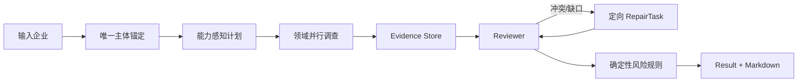

# 企业信用与风控尽调多 Agent 产品设计

- 状态：Approved / Implemented v1
- 更新：2026-09-04
- 范围：进阶题二与加分项

## 产品目标

用户提交企业标识后，系统完成主体确认、调查计划、并行取证、证据复核、风险判定和报告生成。评审人员先看到结论、风险和缺口，再下钻至企业画像、原始证据、Agent 协作与评测。一次请求同时产出前端完整视图和 Markdown 报告。

该产品证明的协作增益不是“多个 Agent 分段写文章”，而是领域并行、独立审证、跨来源冲突检测和定向返工。规则与报告只消费 Reviewer 冻结后的结构化 Evidence/Finding。

## 用户流程



主体不存在或不唯一时明确失败。数据查询落入 `verified_records`、`verified_empty`、`capability_absent`、`source_error` 或 `degraded_mock`，绝不把失败解释为无风险，也不使用 Mock 覆盖已核验空结果。

产品提供两条同契约运行路径：显式配置 `JINDIAO_DATA_SOURCE_MODE=tianyancha`、提供授权并省略 `scenario_id` 时走天眼查优先的实时混合路径；默认或指定 `scenario_id` 时走冻结 Mock 路径。实时混合路径在同一个 Result 中逐条披露 Tianyancha Evidence、固定完整模板补充和失败能力；主体已锚定且请求显式允许降级时，即使全部业务领域失败也能生成八章报告。成功返回空记录的能力不为该子模块加载 Mock。Markdown 仅在标题后集中显示一次 Mock 数据提示，结构化 Evidence 继续保留逐条来源。Mock 路径用于离线演示和公平评测。

## AgentTeams 分工

| 角色 | 职责 | 输出 |
| --- | --- | --- |
| Leader | 能力发现、DAG、预算、调度与收敛 | InvestigationPlan |
| Governance | 工商、股东、高管、投资和分支 | 治理 Findings/Evidence |
| Judicial & Compliance | 执行、失信、限高、案件与处罚 | 司法 Findings/Evidence |
| Operations & Peer | 经营异常、财务、资质、招投标与同业 | 经营 Findings/Evidence |
| DeepSearch Evidence | 只处理策略允许的本地补充检索 | `mock://` Evidence |
| Reviewer | 主体、日期、金额、重复、充分性与冲突 | ReviewIssue/RepairTask |

最大返工次数、并发数、工具调用数和总超时由 Run Context 冻结。预算耗尽后保留“未确认”和数据缺口，不无限循环。

模型模式默认使用官方 `Runner.run_agent_team_streaming` 执行 `TeamAgentSpec`。同一 Run Context 的主体、报告时点、快照、规则/Skill 版本、预算和计划全部注入团队；至少收到一个可观测协调事件后才开放专项执行，框架失败或空运行会阻断结果。`offline_mock` 是测试、演示和 benchmark 显式选择的确定性 runtime，不是生产默认旁路。

## 信息架构

ReportViewModel 提供十类前端视图：任务状态、尽调结论、风险驾驶舱、企业画像、司法合规、经营情况、关联关系、同类企业分析、证据中心、协作与评测。Markdown 包含八类标准报告章节：摘要、风险摘要、企业基本信息、司法风险、经营风险、经营情况、关联信息和同类企业分析。

四个领域任务内部再按标准报告拆成 48 个可定位子模块：Governance 10 个、Judicial 9 个、Operations 25 个、Peers 4 个。每个子模块独立选择天眼查 capability、记录来源状态并装配记录；相同工具在同一运行中去重，不因多个子模块复用而重复请求。实时模式还可将最近年报社保信息作为第 49 个可选企业基本信息子模块；没有年报时保留 `verified_empty`。报告摘要汇总实际子模块数和来源状态，对应章节则输出可直接用于前端的 `data.submodules`。

风险分由版本化规则计算：`[0,20)` 通过、`[20,80)` 人工复核、`[80,+∞)` 拒绝。每个 RuleHit 绑定 Finding 和 Evidence；无证据的普通模型判断不能计分。跨来源冲突可以通过显式的、证据充分的 unconfirmed guard rule 进入人工复核，但不能伪装为已确认事实。

## 对外接口

推荐前端使用 Run 资源接口创建、查询、订阅、取结果和取消；`POST /api/v1/due-diligence/result` 作为兼容适配器保留。所有入口复用同一个 RunCoordinator，不暴露内部 Agent 或工具接口。请求的 `report_as_of` 是 Reviewer、质量计算和最终 Decision 的统一时点。

```text
POST /api/v2/due-diligence/runs
GET  /api/v2/due-diligence/runs/{run_id}
GET  /api/v2/due-diligence/runs/{run_id}/events
GET  /api/v2/due-diligence/runs/{run_id}/result
POST /api/v2/due-diligence/runs/{run_id}/cancel
```

Run 观测是前端展示层，不是新的评测臂：事件只记录阶段、Agent/Check 状态、usage、Evidence ID、复核/返工和终止原因。共享 acquisition 中的 `deepsearch-agent` 不计入调查 Agent roster；`mode=single|multi` 仍只切换 investigation 拓扑，公平比较继续复用同一快照、目录、规则与预算。

## Skills 与演进

四个可复用技能包覆盖天眼查证据获取、年报社保补证、证据化团队协作和报告反馈。当前报告反馈为本地比赛 Demo：用户对 completed/partial 报告的已有缺口位置提交反馈，系统对源报告及八个独立固定案例实际渲染并展示 before/after/diff；通过门禁后，由演示者用本地 CLI 明确应用。下一次新受理 Run 使用新版本，reset 恢复基线，源报告与历史事件保持不变。

唯一允许改变的是缺口展示位置；风险分、事实、Evidence、来源和 Mock 提示保持原样。反馈文字不写入 Prompt 或规则。旧 `skill_feedback` 返回 rejected/use_feedback_api，不生成候选；当前接口、启动边界及可复现演示见 [API](api/README.md#8-用户反馈报告-demo已实现默认关闭) 和 [反馈 Demo](reporting-feedback-demo.md)。

Demo 默认关闭，只允许本地单进程与单操作人。owner/session 是归属检查，不是生产认证；共享发布、双角色权限、SQLite 注册表和 HTTP 发布接口留待后续。九例通过仅证明这些样本的展示改善，不证明模型、风险召回或 Agent 协作增益。

## 验收与实验

10 个固定场景覆盖正常、司法风险、经营风险、跨源冲突、有效空、能力缺失、源错误、报告缺口和同名主体。single/multi 使用相同数据、模型、参数、预算、规则与输出契约。独立 `scripts/compare_agents.py` 只复用正式 BenchmarkRunner，不维护第二套评分逻辑。质量总分权重为 30/25/20/15/10；当前 60 次配对记录显示 multi 质量 0.76125、single 0.65625，差值 0.105，95% 区间 `[0.046624, 0.163376]`。

完整的决策理由和边界见 [OpenSpec design](../openspec/changes/design-enterprise-due-diligence-product/design.md)，技术实现见 [technical-stack.md](technical-stack.md)，实验协议见 [evaluation/README.md](evaluation/README.md)。
