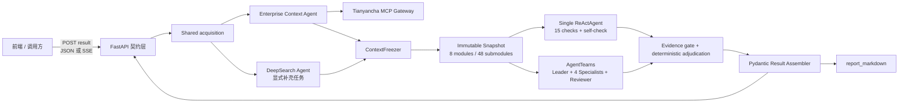

# Jindiao 技术栈与工程约束

- 状态：Implemented v2
- 最后更新：2026-09-05
- 评分范围：仅面向进阶题二与加分项
- 关键词：openJiuwen、agent-Core、DeepSearch、AgentTeams、Team Skill、技能自演进、FastAPI、SSE、企业信用尽调、单机、Mock、AgentArts、单智能体对比

## 1. 决策摘要

Jindiao 采用 **Python 单体高代码应用**：FastAPI 以 Run 资源接口、兼容 `result` 接口和 AgentArts `/invocations` 适配同一个 `RunCoordinator`；进程内先由 Enterprise Context Agent 与受限 DeepSearch Agent 完成共享采集并冻结证据，再由一个 `ReActAgent` 或 openJiuwen AgentTeams 在同一快照上执行固定核查，最后由确定性组件裁决和组装报告。执行态由 `RunRepository`、`EventStore` 和 `RunProjection` 解耦，默认 attached；detached 需共享存储探针通过。

该项目不以既有 AgentArts Workflow JSONL 为实现基础。旧工作流只能作为业务参考或样例数据，不得决定新系统的编排、分层和接口。

## 2. 核心技术栈

| 层次 | 选型 | 版本/形式 | 职责与约束 |
| --- | --- | --- | --- |
| 语言 | CPython | 3.11.4 | agent-Core 与 DeepSearch 均支持 `>=3.11,<3.14`；固定 3.11.4 降低比赛环境差异 |
| 依赖管理 | requirements.txt + uv | pip 兼容清单；uv 0.11.6；`uv.lock` 入库 | `requirements.txt` 提供通用安装入口，uv 负责锁定和一键同步 |
| 智能体核心 | openJiuwen agent-Core | `openjiuwen==0.1.17` | Agent、Harness、Runner、AgentTeams、Skills、演进 Rail、观测 |
| 深度检索 | openJiuwen DeepSearch | 源码版本 0.2.0，公开 commit 固定 | 以 Python SDK 嵌入共享 acquisition；只处理显式补充任务，不进入 investigation roster |
| API | FastAPI | 0.115.11 | 请求校验、内容协商、唯一业务端点 |
| ASGI | Uvicorn | 0.38.0 | 单进程开发与单机容器运行 |
| 数据契约 | Pydantic | 2.11.7 | 请求、事件、证据、评分、最终结果的强类型模型 |
| 流式输出 | SSE | `sse-starlette>=2.1,<4` | 同一 URL 流式返回进度；同时支持普通 JSON 结果 |
| Mock 数据 | JSON / JSONL / Markdown | 本地文件 | 案例、证据、搜索语料、标准答案和报告模板 |
| 工具集成 | Python Tool + 本地 STDIO MCP | 进程内/本机子进程 | 简单纯函数直接用 Tool；需要展示 MCP 复用性的 Mock 能力用 STDIO MCP |
| 观测 | OpenTelemetry + 结构化 JSONL | agent-Core observability extra | 统一 `request_id/run_id/agent/task/tool`，记录时延、状态、token 与证据引用 |
| 测试 | pytest + pytest-asyncio | 当期锁定版 | 覆盖单元、集成、API 契约与端到端场景 |
| 评测 | Python benchmark CLI + `PairedComparisonRunner` | 仓库内自研 | 一次采集、冻结分叉，在同快照/模型/目录/预算上比较 single 与 multi |
| 质量门禁 | Ruff + mypy + pytest | 由 `uv.lock` 锁定 | `make check` 本地统一执行 |
| 部署 | 单 Docker 镜像 | 单服务 | 不拆分 agent 微服务，不引入编排中间件 |

### 2.1 发行包安装与源码参考

Jindiao 的正式依赖来自公开 Python 发行包或公开仓库的确定 commit：

- `openjiuwen[observability,sqlite]==0.1.17`
- `openjiuwen-deepsearch` 固定到公开 DeepSearch 仓库 commit `cbab9c29219873af3da8a96eba85232a0f7154bc` 的 `deepsearch/` 子目录（源码版本为 0.2.0）
- AgentArts 加分项通过 `openjiuwen[agentarts]==0.1.17` extra 安装

仓库根目录的 `requirements.txt` 是完整开发与参赛环境的通用安装入口，包含运行时、测试、质量门禁和 AgentArts 加分项直接依赖。`pyproject.toml` 保留项目元数据、依赖分组与构建配置，最终通过 `uv.lock` 固定完整传递依赖。

本机可选的两个相邻仓库只用于阅读源码、核对 API 和执行兼容性验证：

- agent-Core 参考目录：`../agent-core`
- DeepSearch SDK 参考目录：`../deepsearch/deepsearch`

项目不得通过 `tool.uv.sources`、可编辑路径依赖或绝对路径引用上述仓库；即使删除这两个源码目录，也必须能按 `requirements.txt` 或 `pyproject.toml` 完成安装。DeepSearch 0.2.0 尚未在当前公开包索引提供对应发行版，因此使用公开 VCS commit；其依赖 `openjiuwen[observability]==0.1.17`，与选定 agent-Core 版本相容。

若公开发行包暂时不可获得，必须使用可公开访问并固定 commit 的 VCS requirement，同时在 README 解释原因；不得依赖参赛机器上的私有路径。

## 3. 运行时架构



所有组件在一台机器上运行。FastAPI、ReActAgent、AgentTeams、DeepSearch SDK 和结果组装器处于同一应用进程；只有用于展示标准 MCP 协议的 Mock MCP Server 可作为本机 STDIO 子进程。

## 4. agent-Core 编排决策

### 4.1 single 与 AgentTeams 是两种正式调查拓扑

- single 使用一个真实 openJiuwen `ReActAgent`，获得完整 CheckCatalog、按核查授权的只读快照工具、结构化提交工具和自检工具。
- multi 用 `TeamAgentSpec` 声明 Leader、Corporate、Judicial & Compliance、Financial & Operations、Related & Peer、Reviewer；常规调用走 `Runner.run_agent_team_streaming(agent_team=spec, ...)`。
- Leader 使用目录化分配工具；专业成员只读各自任务范围并提交结果；Reviewer 读取提交并发起有界返工。`deepsearch-agent` 不在该 roster 中。
- 团队业务生命周期持续到 15 项核查全部终态且 Reviewer 不再有 RepairTask，或失败、取消、预算耗尽；建队成功不是终止条件。
- 所有成员的 LLM、Token、schema 重试、通信、返工和快照读取计入 multi 唯一 `BudgetLedger`，成功或异常后统一清理团队资源。
- streaming chunk 先转换为稳定公开事件并递归脱敏，不把框架内部 Prompt、reasoning 或原始响应泄漏给前端。

### 4.2 采集 Agent 与 DeepSearch 是共享前置层

- `EnterpriseContextAgent` 是天眼查 MCP 唯一业务调用者；`TianyanchaMcpGateway` 负责授权、主体/时点/capability/预算绑定、分页、重试、并发、清洗和 Evidence 标准化。
- `SupplementPolicy` 只生成 `baseline_enrichment` 或 `evidence_gap`；DeepSearch Agent 仅处理显式任务，并受允许 Tool、来源、目标子模块和调用预算约束。
- 年报 Skill/Tool 只挂载给精确的 `deepsearch-agent`。当前 Provider 只访问白名单年报 URL，并把社保披露写入 `operations-analysis/annual_reports/social_security` 局部事实组。
- DeepSearch 输出与 MCP Evidence 分层保存，不覆盖 `verified_empty` 或其他原始来源状态；冲突通过引用关系表达。
- `DeepSearchEvidenceAgent` facade 和 `ScenarioDeepSearchProvider` 只保留给 `formal_agent_run=false` 的 deterministic harness / 回归兼容，不作为正式 Agent 执行证据。

## 5. Skills 与反馈自演进

项目至少沉淀 3 个可复用技能包，物理上放在顶层 `skills/`：

```text
skills/
├── agent/<skill-name>/SKILL.md   # 单 Agent 可复用能力
└── team/<skill-name>/SKILL.md    # 团队级协作能力
```

当前 `feedback-evolved-reporting` 使用显式开启的本地比赛 Demo：已完成/partial Run 的安全快照 → 两个 v2 反馈/对比 API → 源案例加八个固定独立案例的实际渲染 → 演示者本地 CLI apply/reset → 下一次新 Run 生效。仅调整已有缺口的展示位置，不修改 System Prompt、事实、证据、规则或 Mock 标识。

`RunCoordinator.create` 首次受理时保存版本/revision/策略/hash；独立 service 入口冻结一次，paired 两臂使用同一绑定。安全 replay 经脱敏、引用/重现和实际体积检查，与最终 result/report/metrics 同次进入 manifest。快照失败隔离于主结果；主产物或 RunRepository 保存失败不得返回成功。

候选和活动状态保存在 artifact root 下的 `reporting-demo/` JSON 文件，采用原子替换及短文件锁；apply 重新校验文件、父绑定、实现/suite 指纹和真实回放，reset 恢复 1.1.0 并保留历史。仅 development/test + memory/local、回环访问、单进程单操作人；无 SQLite 发布注册表、双角色认证、HTTP activate/rollback 或后台恢复。

旧 result/v2/invocations 的 `skill_feedback` 已 deprecated，统一 rejected/use_feedback_api。旧 Python coordinator 同样拒绝；generic `TeamSkillEvolutionRail` / `EvolutionInterruptRail` / `EvolutionReviewRuntime` helpers 保留兼容测试，但没有接入本 Demo 的真实回放与应用链路。可重复命令和输出证据见 [反馈 Demo](reporting-feedback-demo.md)。

复用说明至少包含：用途、输入/输出、前置条件、安装/挂载方式、最小示例、评测集、版本和变更日志。

## 6. 对外接口

兼容业务端点保留为：

```http
POST /api/v1/due-diligence/result
```

推荐前端使用版本化 Run API：

```text
POST /api/v2/due-diligence/runs
GET  /api/v2/due-diligence/runs/{run_id}
GET  /api/v2/due-diligence/runs/{run_id}/events
GET  /api/v2/due-diligence/runs/{run_id}/result
POST /api/v2/due-diligence/runs/{run_id}/cancel
```

同一 URL 通过 `Accept` 头做内容协商：

- `application/json`：任务完成后一次返回完整结果。
- `text/event-stream`：返回进度、agent 状态、证据、告警和最终结果事件。

同一 URL 通过可选查询参数 `mode=single|multi` 只切换 investigation 拓扑，默认 `multi`；shared acquisition 和 deterministic adjudication 不随 mode 改变。实际模式写入 Result，JSON 与 SSE 共用该语义。

结果外壳必须能支撑前端全量展示，并同时返回 Markdown 报告：

```json
{
  "meta": {"request_id": "...", "status": "completed"},
  "subject": {},
  "decision": {},
  "evidence": [],
  "risk_summary": {},
  "agent_results": [],
  "report_structure": {"module_count": 8, "submodule_count": 48},
  "context_snapshot": {},
  "execution_cost": {
    "shared_acquisition_cost": {},
    "investigation_cost": {}
  },
  "comparison_metadata": {},
  "collaboration": {},
  "evaluation": {},
  "skill_evolution": {},
  "sections": [],
  "report_markdown": "# ...",
  "errors": []
}
```

`agent_results` 的权威语义是每个 Agent 对应的风险项和 `FactEvidenceRef`；`report_structure` 固定为 8 大模块、48 个标准子模块。`context_snapshot` 标识事实输入，`execution_cost` 分离共享采集与当前调查臂成本。上述外壳已通过版本化 Pydantic 子模型和 JSON/SSE 端到端测试实现。不对外暴露单个 Agent、内部 Tool、DeepSearch 或 paired runner 的独立端点。

## 7. 数据与持久化边界

- 业务 Mock 数据放在 `mock_data/`，只读载入。
- 报告、轨迹、评测结果和中间产物写入 `artifacts/`或 `benchmarks/results/`，默认不入 Git。
- 不运行 MySQL、PostgreSQL、Redis、Milvus、Elasticsearch、MQ 或独立向量库。
- AgentTeams 如果需要存储抽象，仅允许使用 SQLite `:memory:` 作为任务期内的运行时消息板；不创建持久化数据库文件，不将其视为业务数据库。
- agent-Core 自身可能包含多种存储或向量库的 Python 依赖；Jindiao 不启动、不配置这些外部组件。
- 公开事件、Result、JSONL、Markdown 和 benchmark 产物统一经过递归脱敏；Prompt 正文、私有 `reasoning` / `reasoning_content` / `chain_of_thought`、密钥及未脱敏 MCP/网页响应不得持久化或返回。
- 可审计信息限定为任务/check ID、Prompt/目录版本与哈希、受限 `decision_summary`、Evidence ID、快照哈希、usage、提交/复核状态和终止原因，不尝试重建模型私有思维链。
- `JINDIAO_EXECUTION_PROFILE=attached` 是默认发布 profile；`detached` 只能在后台任务、HealthyBusy、共享 session/SFS、跨 endpoint session、SSE 重连和取消传播探针通过后，与 `JINDIAO_DETACHED_PROBE_PASSED=true` 一起启用。重启发现遗留 `running` Run 时标记为 `interrupted`/`failed`，不伪造恢复。

## 8. 单智能体 vs 多智能体实验设计约束

公平 pair 先运行一次 acquisition 和 freeze，再把同一个 `EnterpriseContextSnapshot` 交给两臂。两种模式共用同一 API、Pydantic 结果契约、模型及采样参数、公共 Prompt 核心、15 项 CheckCatalog、8/48 ReportCatalog、规则/evaluator 版本和数值相同的总分析预算。业务接口通过 `mode` 查询参数选择单臂；`PairedComparisonRunner` 负责显式成对执行。

`ComparisonFingerprint` 在调查前校验上述等价条件。multi 的 Leader、四个专业 Agent、Reviewer、协调、schema 重试和返工全部计入一份 investigation 账本；Context Agent、DeepSearch Agent、MCP 和年报 Tool 只计入一次 `shared_acquisition_cost`。

fake/offline、无成功 LLM usage、Token 为零、固定核查提交不完整或预算越界的 pair 只能作为诊断数据，不能标记 formal。即使单个 pair 通过 `formal_eligibility`，也必须完成 manifest 预注册的场景、重复次数、指标权重和阈值后才能声明协作增益。

建议同时量化四类指标：

- 耗时：端到端时延、首条有效提交时间、并行度。
- 质量：固定核查覆盖、Evidence 充分性、风险质量、冲突检出率、报告结构分。
- 成本：LLM 请求、输入/输出/总 Token、schema 重试、返工和共享采集成本。
- 成功率：在超时与预算内产出通过 schema / Evidence 门禁的完整 15 项核查比例。

评测原始记录保存为 JSONL，聚合结果保存为 JSON/Markdown，README 中最终展示可重跑的命令和结果表。

## 9. 模型与配置

- 通过 openJiuwen 的模型抽象接入 OpenAI-compatible provider，不在业务代码绑定某个厂商。
- 模型名、Base URL、API Key、超时和并发数通过环境变量注入。
- 正式路径必须显式设置 `JINDIAO_AGENT_RUNTIME_MODE=formal` 和完整非 fake 模型路由；缺项时在业务执行前失败，不静默切回 deterministic harness。
- 单智能体/多智能体对比必须使用同一 provider、model、采样参数和总分析预算。
- `.env` 永不入库，仓库只提交 `.env.example`。
- 显式设置 `JINDIAO_DATA_SOURCE_MODE=tianyancha`、提供授权且请求未指定 `scenario_id` 时，Context Agent 按 `config/tianyancha-capability-routes.json` 覆盖 48 个标准子模块；调查 Agent 不直接访问外部源。
- Context Gateway 和 AgentTeams 都受 Run 级并发/预算约束；相同 MCP 请求去重，工具失败按子模块隔离并保留 `source_error`，不解释为无风险。
- 实时共享采集默认启用天眼查年报社保 Provider，只访问 `www.tianyancha.com/annualReport/{company_id}/{year}`，默认向前有界检查 5 年；无结果保留 `verified_empty`，有效事实归入既有 `annual_reports.social_security`，绝不产生第 49 子模块。
- 子模块统一装配 `availability/completeness/facts/evidence_ids/supplemental_evidence_ids/provenance/gaps/conflicts`，通过唯一 Result 输出，不新增后端接口。
- `deepsearch-agent` 只属于 acquisition，用于策略允许的受限补充；它不计入 investigation roster。Run 事件观测只展示状态和摘要，不改变 single/multi 的公平比较口径。

## 10. AgentArts 加分项适配

AgentArts 只作为发布与治理适配层，不改变本地单体架构：

- Gateway：发布 `/invocations` 以及 PREFIX_MATCH 下的 v2 Run 路径。
- Memory：只保存反馈、运行摘要和 Skill 版本元数据；不上传企业原始尽调数据。
- Sandbox：执行确定性规则、schema 校验和 benchmark，不分叉另一套应用代码。

AgentArts 适配为可选依赖组，本地主流程不依赖 AgentArts 联网或云端服务。

### 10.1 迁移、回滚与反馈闭环对齐

- `RunRepository` 是运行元数据的唯一来源；反馈闭环复用同一 `run_id`、结果链接、主体归属和策略/版本快照，不另建一套运行表。
- 迁移顺序是先启用 v2 attached，再验证共享存储与异步生命周期，最后才开放 detached；回滚只需关闭 v2/detached 开关并继续使用 v1 facade，已有脱敏产物可继续读取。
- `add-user-feedback-reporting-loop` 的反馈请求必须绑定 completed/partial Run 和当前 reporting policy 绑定（版本、revision、内容和哈希），候选 Skill 的状态与报告 diff 通过链接读取，不把反馈管理状态混入尽调风险结果。

## 11. 明确不选择

- 不以 AgentArts Workflow 或已有 JSONL 工作流作为主编排。
- 不部署 DeepSearch 的完整后端服务。
- 不将每个 agent 拆成独立 HTTP 微服务。
- 不引入 Celery、Kafka、Pulsar、Redis 等任务或消息中间件。
- 不引入外部持久化数据库、独立向量数据库或分布式存储。
- 本阶段不冻结前端技术栈和大模型厂商；正式业务 Agent roster、15 项 CheckCatalog 与 8/48 ReportCatalog 已版本化冻结。

## 12. 已落地文档与仍需联调的事项

- 已评审产品方案：[product-design.md](product-design.md)。
- 当前架构：[architecture/README.md](architecture/README.md)。
- API 契约（v2 Run 资源与 v1 兼容接口）：[api/README.md](api/README.md)。
- 配对实验：[evaluation/README.md](evaluation/README.md)。
- 单机部署：[deployment/README.md](deployment/README.md)。
- 已在正式授权环境确认天眼查主体、capability 路由、有效空结果和唯一 Result 链路。2026-09-05 的 live paired smoke 证明一次采集/冻结后 single 与 multi 共用同 snapshot、模型、15 项核查和 1,500,000 总 Token 预算，且两臂均产生真实 provider usage，`formal_eligibility.eligible=true`。
- 现有 60 条冻结 Mock benchmark 明确属于 `formal_agent_run=false` 的 deterministic regression；只验证契约与评分，不作为真实 Agent 协作增益证据。
- AgentArts 实际云端发布映射和前端框架不在本后端变更范围内。

## 13. 本地依据

本文档的版本和 API 决策基于当前本地源码：

- `agent-core/pyproject.toml`：`openjiuwen==0.1.17`、Python 范围、observability/sqlite/agentarts extras。
- `deepsearch/deepsearch/pyproject.toml`：`openjiuwen-deepsearch==0.2.0`、`openjiuwen[observability]==0.1.17`。
- `agent-core/openjiuwen/agent_teams/schema/blueprint.py`：`TeamAgentSpec`。
- `agent-core/openjiuwen/core/runner/team_runner.py`：`Runner.run_agent_team_streaming()`。
- `agent-core/openjiuwen/harness/rails/evolution/`：技能演进、中断审批和 Review Runtime。

若参考源码或发行包版本升级，先运行兼容性验证，再同步更新 `requirements.txt`、`pyproject.toml`、本文档和 `uv.lock`。
