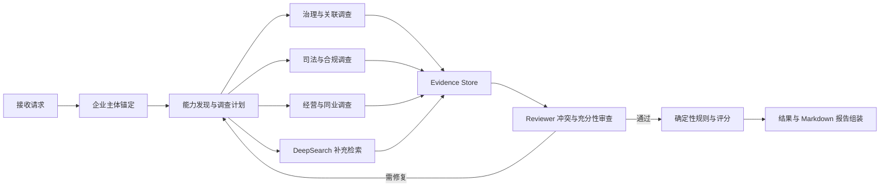

## Context

Jindiao 是面向企业信用与风控尽调竞赛场景的单机高代码应用。当前仓库已经冻结 Python、FastAPI、openJiuwen agent-Core、DeepSearch、Pydantic、SSE、pytest 与本地文件数据等技术栈，但尚未固化产品流程、团队拓扑、证据契约、报告结构、Mock 回退规则和单双 Agent 对照实验。

产品参考标准经营分析报告的内容边界，需覆盖报告摘要、风险摘要、企业基本信息、司法风险、经营风险、经营情况、关联信息和同类企业分析。天眼查 MCP 是企业公开信息的首选数据源；其无法提供的能力由固定的企业级 Mock 数据补足。对外仅允许一个 result 业务接口，同时返回全部前端信息和 Markdown 报告。

主要利益相关者包括：提交企业尽调任务的业务用户、查看风险与证据的审核人员、复现实验的评委、维护规则与 Skills 的开发者。评委需要看到可解释的协作过程，以及在公平条件下量化的多智能体增益。

约束如下：

- 使用 agent-Core 的公开 Python 发行包和 DeepSearch 的公开固定 commit 组合开发，AgentTeams 是唯一多智能体编排核心；本地源码仓库只用于查阅 API、核对实现和兼容性验证，不构成安装依赖。
- 单机运行，不引入业务数据库、Redis、消息队列、独立向量库或微服务。
- 不以旧 AgentArts Workflow JSONL 为实现基础，只允许将其作为业务样例参考。
- Mock 数据对同一测试企业必须固定、可版本化、可校验，并被所有 Agent 一致读取。
- 天眼查的有效空结果不能被 Mock 覆盖，降级事实必须对用户可见。
- 风险分、准入分档和硬规则必须由确定性代码执行，不能由模型自由决定。
- 任何密钥只能由运行时环境变量注入，不能进入文档、仓库、Mock 或日志。

## Goals / Non-Goals

**Goals:**

- 提供从企业主体确认到结构化结果和 Markdown 报告的一站式尽调体验。
- 通过职责分工、并行调查、独立审证和定向返工形成可观察的多 Agent 协作增益。
- 让每条关键结论都能追溯到天眼查或 Mock 原始记录，并明确查询时点、置信度和数据状态。
- 用一个稳定 result 契约支撑前端进度、风险、企业画像、证据、协作轨迹、评测和技能演进展示。
- 提供三个独立可复用 Skills，其中一个具备受控的反馈自演进能力。
- 在相同模型、数据、参数和预算下，复现单智能体与多智能体的耗时、质量和成功率对比。
- 提供本地命令和单容器两种一键运行方式。

**Non-Goals:**

- 不建设生产级征信系统，不承诺报告可直接替代人工授信或法律判断。
- 不建设多租户、用户中心、计费、持久化任务中心或后台运营系统。
- 不抓取或伪造天眼查未授权的数据，不将“查询失败”解释为“无风险”。
- 不实现分布式 Agent 调度，不把每个 Agent 拆成独立服务。
- 不在本变更中冻结具体前端框架；后端只保证完整的前端视图模型和 SSE 事件。
- 不允许技能自演进自动改变风险阈值、硬规则、数据源优先级、Mock 标识或证据完整性要求。

## Decisions

### 1. 产品流程采用“证据流水线”，而非报告段落拼接

一次运行按以下阶段推进：



每个调查 Agent 只提交结构化 Finding 和 Evidence，不直接撰写最终结论。Reviewer 先检查主体、来源、时间、金额、状态和证据支持关系，再允许规则引擎和报告组装器消费结果。这样可以避免不同 Agent 各自生成一段文字后简单拼接所导致的矛盾与重复。

备选方案是按标准报告章节各自生成文本，优点是实现快，但难以证明协作增益，也无法稳定做证据去重、冲突修复和确定性评分，因此不采用。

### 2. AgentTeams 采用协调者、三类专项调查者、检索者和独立 Reviewer

团队角色固定为：

| 角色 | 主要职责 | 主要产物 |
| --- | --- | --- |
| Leader / Planner | 主体确认、能力清单、任务 DAG、预算、调度、返工收敛 | InvestigationPlan、RepairTask |
| Governance Agent | 工商登记、股东、高管、变更、投资、分支、受益所有人与实控人 | 治理和关联 Findings |
| Judicial & Compliance Agent | 司法案件、执行失信、限高、处罚、异常、税务、质押冻结等 | 司法与合规 Findings |
| Operations & Peer Agent | 许可资质、信用、海关、招投标、舆情、年报财务、同业指标 | 经营与同业 Findings |
| DeepSearch Evidence Agent | 对 MCP 缺失能力检索本地企业场景的非结构化材料 | 带 `mock://` 引用的 Evidence |
| Evidence Reviewer | 去重、交叉核验、冲突检测、证据充分性判断和定向返工 | ReviewIssue、ReviewDecision |

最终规则计算和报告组装使用普通 Python 组件，不额外包装成自主 Agent，以确保评分和输出结构可重复。Leader 最多发起有限次数的定向返工；达到预算后必须输出覆盖缺口，不能无限循环。

备选方案是一个通用 Agent 加大量工具。它的调用链更短，但职责隔离、并行度和独立复核不足，保留为 benchmark 的 single-agent 基线，而不是主产品方案。

### 3. 天眼查查询采用主体锚定、能力发现和证据标准化三层适配

天眼查适配器隐藏 MCP 传输和工具返回差异，业务层只依赖统一接口。查询顺序为：

1. 使用企业搜索获得候选企业。
2. 结合企业名称、统一社会信用代码、地区和状态完成主体锚定，产生稳定 `subject_id`。
3. 查询该主体的 capability manifest，只有清单中存在的能力才调用对应业务工具。
4. 将业务记录映射为 Evidence；保留源工具、源记录标识、查询时间和原始摘要。
5. 合并重复记录，但不丢弃来源链。

主要领域到天眼查能力的映射由配置维护，而不是写入 Agent prompt。典型映射包括：

| 领域 | 典型能力 |
| --- | --- |
| 主体 | 企业搜索、基本画像、工商登记 |
| 治理关联 | 股东、高管、变更、对外投资、分支、实控人、受益所有人、集团关系 |
| 司法 | 风险概览、失信、被执行、限高、裁判文书、案件、开庭、立案、公告、冻结、拍卖 |
| 经营合规 | 经营异常、严重违法、行政/环保处罚、欠税、清算注销、抵押质押、许可资质 |
| 经营表现 | 信用评价、海关、招投标、舆情、年报和财务数据 |

行贿违法等无法确认独立工具的主题，从司法文书或案件详情中推导，并将 `source_type` 标记为 `derived`；不能虚构工具名。

统一 Evidence 至少包含：

```text
evidence_id, claim, value, subject_id, source_type,
source_tool, source_record_id, queried_at, as_of_date,
confidence, is_mock, supports_fields, raw_ref
```

`raw_ref` 只指向本次运行保存的脱敏原始快照或 Mock 文件位置，不把授权头、模型密钥或完整敏感响应写入日志。

### 4. 数据源回退使用显式状态机

每个查询项必须落入以下状态之一：

| 状态 | 含义 | 行为 |
| --- | --- | --- |
| `verified_records` | capability 存在且有有效记录 | 使用天眼查 Evidence |
| `verified_empty` | capability 存在且成功返回空 | 记录“已核验无记录”，禁止 Mock 补齐 |
| `capability_absent` | manifest 明确无该能力 | 允许 DeepSearch 查询当前企业 Mock 场景 |
| `source_error` | 鉴权、限流、超时或协议错误 | 按策略重试；最终标记不可用，不等同空结果 |
| `degraded_mock` | 演示模式明确允许在源错误后降级 | 使用 Mock，但必须标记 degraded、原因和原状态 |

默认生产语义不允许 `source_error → mock`。比赛离线演示可通过显式请求配置开启 `degraded_mock`。结构化 Result 的 `meta`、coverage 和 Evidence 始终保留来源状态；Markdown 只在报告顶部显示一次醒目的 Mock/降级提示，正文不重复渲染同类提醒，但证据行仍保留必要的来源标识。

备选方案是“查不到就 Mock”，虽然演示完整，但会把无记录、无能力和查询失败混为一谈，破坏可信度，因此拒绝。

### 5. 每个测试企业使用不可变、共享的 Mock 场景快照

Mock 数据按企业组织，而不是所有企业共用一套数据，也不为不同 Agent 生成不同结果：

```text
mock_data/scenarios/<scenario_id>/
├── manifest.json
├── company.json
├── governance.json
├── judicial.json
├── operations.json
├── peers.json
├── corpus/
│   └── *.md
└── expected/
    ├── findings.json
    └── decision.json
```

`manifest.json` 包含 `scenario_id`、`enterprise_key`、`version`、`as_of_date`、文件清单和内容哈希。Run Context 在任务开始时解析并冻结 `scenario_snapshot_id`，后续所有 Agent 只能通过同一个只读 ScenarioRepository 访问该快照。文件哈希不一致、企业键不匹配或版本不存在时立即失败，禁止静默读取相邻企业数据。

DeepSearch 的本地 provider 仅索引当前快照的 `corpus/`，返回 `mock://<scenario>/<version>/<path>#<fragment>` 引用。结构化 Mock 查询同样生成 Evidence，并设置 `source_type=mock`、`is_mock=true`。

实时天眼查模式可在主体已经唯一锚定后，使用 `live_fallback_scenario_id` 指向一份完整、固定且可校验的报告补充模板。该模板仅用于 capability 缺失或请求显式允许的 `source_error` 降级，必须以真实主体字段覆盖模板主体字段，并继续标记全部补充 Evidence 为 Mock；`verified_empty`、主体不存在或主体歧义不得使用该模板。该通用模板不进入真实企业事实判断，也不用于替代按企业隔离的正式 benchmark 场景。

### 6. 风险判定采用“Finding + Rule Engine + Decision”三段式

专项 Agent 输出 Finding：风险类别、事实、严重度建议、涉及主体、时间、金额、状态和 Evidence 引用。规则引擎验证证据门槛后，根据版本化规则表计算：

- 准入类风险：触发硬拒绝或必须人工复核的事件。
- 关注类风险：参与累计分，但不直接绕过阈值作主观拒绝。
- 信息缺口：影响置信度和覆盖率，不自动解释为低风险。

初始分档与标准报告保持一致：

- `[0, 20)`：通过。
- `[20, 80)`：人工复核。
- `[80, +∞)`：拒绝。

规则包携带 `rule_version`，输出每个规则的触发事实、加分、证据和解释。任何缺乏 Evidence 的模型判断不能进入分数。规则、阈值和分档只通过代码评审与回归测试更新，不进入 Skill 自演进范围。

### 7. 产品信息架构以“先结论、再风险、后证据和协作”组织

结构化结果和 Markdown 报告共享同一个 ReportViewModel，避免两个输出口径不一致。前端可据此呈现：

1. 任务状态：主体、数据时点、运行模式、Mock/降级标志、总耗时。
2. 尽调结论：风险分、准入建议、置信度、覆盖率、主要依据和待人工确认项。
3. 风险驾驶舱：准入类风险、关注类风险、风险分布和时间线。
4. 企业画像：基本信息、股东高管、对外投资、分支和工商变更。
5. 司法与合规：执行失信、案件公告、处罚异常、质押冻结等。
6. 经营情况：许可资质、信用海关、招投标、舆情、年报财务。
7. 关联关系：法人对外关系、受益所有人、实控人和关系图数据。
8. 同类企业分析：地区/行业数量、净增、类型分布和行业参考指标。
9. 证据中心：Finding 到 Evidence 的双向引用、来源状态和查询时间。
10. 协作与评测：Agent 任务、冲突与返工、single/multi 指标和 Skill 版本。

报告中必须区分“无风险记录”“数据源不可用”“能力缺失并由 Mock 补足”三种语义。

### 8. 唯一业务接口同时支持同步 JSON 和 SSE

唯一公开端点为：

```http
POST /api/v1/due-diligence/result
```

请求核心字段包括企业标识、报告时点、输出语言、场景标识和是否允许演示降级。端点使用可选查询参数 `mode=single|multi` 切换编排策略，默认 `multi`；JSON 与 SSE 必须使用相同模式并在 Result `meta.mode` 中回显。benchmark CLI 继续在内部构造同一冻结请求并注入评测模式，避免维护第二套评测逻辑。

`Accept: application/json` 等待完成后返回完整结果；`Accept: text/event-stream` 返回增量事件，最后一个 `report.completed` 事件携带同一完整结果。稳定事件集为：

```text
run.accepted
entity.resolved
plan.created
agent.started
evidence.collected
source.fallback
conflict.detected
repair.requested
section.completed
report.completed
skill_evolution.proposed
run.failed
```

最终结果外壳包含：

```text
meta, subject, decision, risk_summary, coverage, sections,
findings, evidence, agent_trace, collaboration, evaluation,
skill_evolution, report_markdown, errors
```

内部 agent-Core chunk 和 DeepSearch SDK 对象不会直接透传，统一由 EventMapper 与 ResultAssembler 转成版本化 Pydantic 模型。SSE 断开时取消下游任务；所有事件携带 `request_id`、`run_id`、`sequence` 和时间戳。

### 9. 三个 Skills 独立打包，自演进采用“建议—审查—回放—批准—激活”

技能包确定为：

| Skill | 类型 | 复用能力 |
| --- | --- | --- |
| `tyc-evidence-acquisition` | Agent Skill | 主体锚定、capability routing、证据映射与数据状态判定 |
| `evidence-backed-due-diligence` | Team Skill | 调查计划、Finding/Evidence 协作、Reviewer 冲突和返工协议 |
| `feedback-evolved-reporting` | Team Skill | 报告表达、反馈归因、改进候选生成和受控版本演进 |

每个 Skill 提供 `SKILL.md`、输入输出 schema、最小示例、评测集、版本和 changelog。反馈演进链路使用 agent-Core 的 TeamSkillEvolutionRail 生成候选，通过 EvolutionInterruptRail 暂停审批，再由 EvolutionReviewRuntime 复核。候选版本必须在固定回放集上不降低事实准确性、证据支持率、风险召回率和 schema 成功率，才可由人工批准激活。

演进结果只写入 `artifacts/skill-evolution/` 的候选目录；稳定 `skills/` 不被运行时静默覆盖。风险规则、数据源优先级、Mock 标记和证据门槛列入不可演进清单。

### 10. 公平基准使用同一业务内核，只替换编排策略

single-agent 与 multi-agent 共用：输入场景、Evidence/Finding 模型、工具适配器、规则引擎、结果组装器、模型和采样参数。差异仅为编排策略：single 由一个 Agent 顺序完成调查和自检；multi 使用上述团队分工与独立 Reviewer。

固定基准集建议包含 10–20 个场景，覆盖正常企业、同名主体、司法高风险、经营异常、证据冲突、天眼查空结果、能力缺失、源错误和报告不完整等情形。每个场景记录随机种子、模型、Skill 版本、规则版本、快照哈希和资源预算。

质量总分采用可解释的加权指标：

```text
quality_score =
  coverage * 30%
  + evidence_support * 25%
  + risk_quality * 20%
  + conflict_detection * 15%
  + report_structure * 10%
```

同时报告端到端耗时、首条有效证据耗时、成功率、工具调用数、token、冲突数和返工数。主结论至少展示一个显著优于 single-agent 的维度，并完整披露其他维度的代价；不为追求“胜出”而给两种模式不同数据或更宽预算。

### 11. 代码结构按契约、编排、数据源和确定性组件分层

```text
src/jindiao/
├── api/                 # result 路由、内容协商、SSE
├── contracts/           # 请求、事件、Evidence、Finding、Result
├── application/         # use case、Run Context、取消与预算
├── agents/              # Leader、专项 Agent、Reviewer
├── orchestration/       # AgentTeams spec、single/multi strategy
├── tianyancha/          # MCP client、capability map、normalizers
├── deepsearch/          # SDK adapter、本地 provider
├── scenarios/           # 只读 Mock repository、hash 校验
├── risk/                # 确定性规则、版本和 decision
├── reporting/           # view model 与 Markdown renderer
├── skills/              # Skill 加载、演进 rail 适配
├── evaluation/          # benchmark runner 与 metrics
└── observability/       # trace、JSONL、脱敏
```

FastAPI 路由不直接调用 Agent；它调用 application use case。外部 SDK 只在适配层出现，便于使用 Mock provider 做离线测试，也避免 API 契约被上游版本变化污染。

### 12. 安全、观测和失败语义内建于 Run Context

Run Context 固定 `request_id`、`run_id`、企业主体、快照、模型、规则、Skill 版本、截止时间和调用预算。每次 tool 调用记录开始/结束、状态、耗时、返回条数和证据 ID，但通过字段白名单脱敏，不记录授权头、API key 或完整原始敏感响应。

失败分为请求错误、主体不明确、数据源错误、Agent 失败、证据审查失败、规则失败和报告失败。可恢复错误进入 `errors` 并允许生成明确标注的不完整报告；主体无法唯一确定、Mock 哈希失败或结果 schema 无法满足时，运行失败而不是输出貌似完整的报告。

## Risks / Trade-offs

- [多 Agent 增加模型调用和尾延迟] → 对独立领域并行执行，设置 Agent/工具预算、截止时间和最多返工次数，并在 benchmark 中同时披露质量收益与时延成本。
- [天眼查 capability 或响应结构变化] → 在适配层使用 capability manifest、版本化映射和契约测试，不让工具名及 SDK 对象进入领域层。
- [Mock 数据被误认为真实数据] → 在结构化 Result 与 Evidence 中保留 `is_mock`/`degraded` 来源信息，Markdown 顶部只显示一次醒目提示，并禁止有效空结果回退。
- [不同 Agent 产生冲突结论] → 只共享结构化 Evidence/Findings，由独立 Reviewer 建立冲突组并发出定向 RepairTask；最终报告不得绕过审查状态。
- [规则分数准确但解释与事实脱节] → 每个规则触发必须绑定 Evidence ID，并增加“计分总和等于明细总和”和“无证据不得计分”测试。
- [DeepSearch 本地语料泄漏其他企业内容] → 每次运行建立快照级检索作用域，所有索引键包含 scenario ID 与版本，禁止跨场景搜索。
- [反馈自演进造成行为漂移] → 候选与稳定 Skill 分离，强制审查、固定集回放、人工批准和一键回滚；硬规则列入不可演进清单。
- [标准报告字段多导致初版范围膨胀] → 按统一 Evidence/Section 契约实现章节，先保证关键风险和证据链完整，再扩充低优先级展示字段。
- [单机内并发导致资源竞争] → 限制并发 Agent 和 DeepSearch worker 数，使用异步 I/O、共享只读场景缓存和可取消任务组。
- [基准结果偶然性过高] → 固定场景快照和采样参数，重复运行并报告均值、分位数与失败样本，不只展示最佳一次。

## Migration Plan

1. 先实现 Pydantic 契约、固定 Mock 场景和确定性规则，形成不依赖模型的纵向最小闭环。
2. 接入天眼查 MCP 适配器与 capability routing，以契约测试校验空结果、无能力和源错误语义。
3. 实现 single-agent 基线，再实现 AgentTeams 多 Agent 拓扑和 Reviewer 返工闭环。
4. 接入 DeepSearch 本地 provider、三个 Skills 和受控演进候选流程。
5. 完成 result JSON/SSE、Markdown 报告、benchmark、README 和单容器部署。
6. 使用固定场景执行端到端回放；达到 schema、证据和评分门槛后冻结演示版本。

本项目当前无线上旧版本或业务数据迁移。若新实现无法通过回归，可切回前一个 Git tag、稳定 Skill 版本和规则版本；Mock 场景通过 manifest 版本选择回滚，不原地覆盖。

## Open Questions

- 前端实现阶段选择何种框架与图表库；这不影响本变更冻结的后端视图模型。
- 天眼查正式演示环境能够稳定开放的 capability 子集及限流额度，需要在联调时形成 capability snapshot。
- 标准报告中的行业历史统计和参考指标是否存在可用 MCP 能力；若无，则作为明确的 Mock-only 能力维护。
- 参赛演示默认采用实时天眼查还是固定回放，需要根据现场网络条件决定，但两者必须保持相同结果契约和来源标识。
- 基准集规模、重复次数和资源预算的最终数值，应在模型与现场硬件确定后冻结并写入 benchmark manifest。
